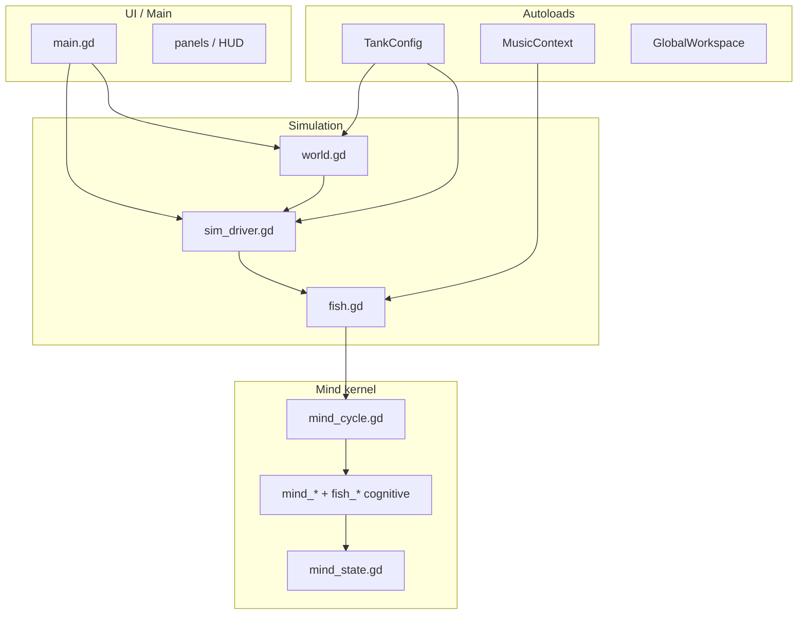

# Architecture — walstad loom / SimFish

*Map for safe refactors. Prerequisite for god-object decomposition
([ENGINEERING_EXCELLENCE #91](docs/ENGINEERING_EXCELLENCE_IDEAS.md)).*

Open the game at `shaders-godot/godot-project/` (Godot 4.6+). Main scene:
`tank_menu.tscn`.

---

## Layer diagram



---

## God-objects (decomposition targets)

| File | ~LOC | Role | Extraction status |
|------|------|------|-------------------|
| `main.gd` | 9.3k | Input, camera, HUD, keeper chat | **Next:** `CameraController`, `PondMode`, `HudController` |
| `world.gd` | 8.7k | Environment build, visuals, spawn | **Next:** typed builders per concern |
| `fish.gd` | 8.4k | Locomotion, behavior tiers, anatomy, mind glue | **Next:** `fish_locomotion.gd`, behavior table |
| `sim_driver.gd` | 6.4k | Chemistry, population, events, guardian | **Started:** `sim_topdown.gd` (flock/sync-turn) |

**Rule:** strangler-fig only — extract behind existing call sites, pin with smokes
(`scripts/run_smokes.sh` or `smoke_runner.gd`).

---

## Extracted modules (reference pattern)

| Module | Lines | Pure? | Tests |
|--------|-------|-------|-------|
| `topdown_motion.gd` | ~560 | Yes — static API, typed I/O | `smoke_topdown_motion.gd` |
| `sim_topdown.gd` | ~320 | State + tick; reads `SimDriver` | `smoke_topdown_pond.gd` |
| `mind_*` + `fish_*` (felt self) | ~30 files | Mostly pure texture/tick funcs | `smoke_felt_self.gd`, `smoke_sentience.gd` |
| `mind_state.gd` + `mind_channel.gd` | ~250 | Sync channel fish ↔ mind | `smoke_mind_channel.gd` |

---

## Autoloads (7)

| Name | Script | Contract |
|------|--------|----------|
| TankConfig | `tank_config.gd` | Tank shape, chemistry tuning, sentience flags |
| MusicContext | `music_context.gd` | Unified music clock, dance mods, phrase choreography |
| GlobalWorkspace | `global_workspace.gd` | GWT bid competition (autoload singleton) |
| AmbientAudio | `ambient_audio.gd` | Procedural generative music |
| MusicReactive | `music_reactive.gd` | External library analysis |
| GuardianLLM | `guardian_llm.gd` | In-process SmolLM2 (desktop) |
| SteamAPI | godotsteam | Platform |

Prefer typed autoload access over `get_node_or_null("/root/…")` (#11).

---

## Mind kernel — single tick path

1. `fish.tick()` → behavior tiers + `_update_inner_life()` (brain tick)
2. `_update_inner_life` → `MindChannel.for_cycle(f)` → `MindCycle.run_attention_phase`
3. Phases: **perceive** (protoself, core affect) → **attend** (bids, workspace) →
   **bind** (felt_now, qualia, volition) → **encode** (episodic)
4. `MindChannel.commit(f, ms)` — **only** write-back to fish private mind fields
5. Voice: `MindContext.build_for_fish(f, sim, situation, ms)` — narrator/LLM context

Felt-self spine (order enforced by `felt_self_layer.gd`):

`protoself → core_affect → relevance → felt_now → binding`

---

## Top-down / pond subsystem

| Layer | File | Notes |
|-------|------|-------|
| Pure math | `topdown_motion.gd` | Moves, formations, surface, path signatures |
| Sim flock | `sim_topdown.gd` | Sync turns, density waves, conduct anchor |
| Fish motion | `fish.gd` `_motion_substep`, `_boids` | Reads `TopdownMotion`, `SimDriver.topdown` |
| Surface | `world.gd` `_tick_topdown_surface` | Shaders: `water.gdshader`, `substrate_caustic.gdshader` |
| Camera | `main.gd` pond mode | Ortho framing, conduct gestures |
| Dance | `music_choreography.gd` | Overhead move/formation casting |

---

## Verification

```bash
# All smokes (local)
./scripts/run_smokes.sh

# Single smoke
./scripts/godot.sh --headless --path shaders-godot/godot-project \
  --script res://scripts/smoke_tank_shapes.gd

# In-Godot runner (#42)
./scripts/godot.sh --headless --path shaders-godot/godot-project \
  --script res://scripts/smoke_runner.gd
```

CI: `.github/workflows/test.yml` — smokes on every PR + gdlint on new modules.

---

## Save / schema

- Tank save version in `sim_driver` export (v5+)
- `MindState.SCHEMA_VERSION` = 3 (extended channel fields)
- Fish still owns scalar fields for save compat; mind dicts sync via `MindState`

---

## Next carve order (recommended)

1. `fish_locomotion.gd` — `_motion_substep` + hydrodynamics integration (~700 LOC)
2. `main_pond.gd` — pond mode + conduct (~150 LOC from `main.gd`)
3. `world_surface.gd` — topdown surface tick + ripples
4. Route remaining `f.get("_mind_*")` in `global_workspace.gd`, `fish_mind.gd` through `MindState`
5. Behavior tier table replacing `fish.tick()` if-ladder (#7)

See [ENGINEERING_EXCELLENCE_IDEAS.md](docs/ENGINEERING_EXCELLENCE_IDEAS.md) for full backlog.
