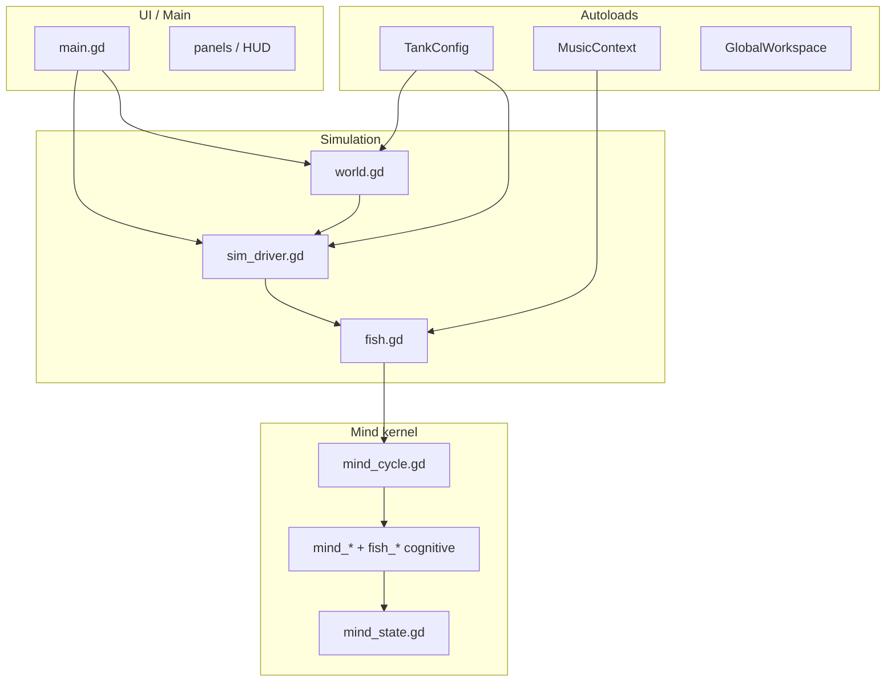

# Architecture — walstad loom / SimFish

*Map for safe refactors. Prerequisite for god-object decomposition
([ENGINEERING_EXCELLENCE #91](docs/ENGINEERING_EXCELLENCE_IDEAS.md)).*

Open the game at `shaders-godot/godot-project/` (Godot 4.6+). Main scene:
`tank_menu.tscn`.

---

## Layer diagram



---

## God-objects (decomposition targets)

| File | ~LOC | Role | Extraction status |
|------|------|------|-------------------|
| `main.gd` | 9.3k | Input, camera, HUD, keeper chat | **Next:** `CameraController`, `PondMode`, `HudController` |
| `world.gd` | 8.7k | Environment build, visuals, spawn | **Next:** typed builders per concern |
| `fish.gd` | 8.4k | Locomotion, behavior tiers, anatomy, mind glue | **Next:** `fish_locomotion.gd`, behavior table |
| `sim_driver.gd` | 6.4k | Chemistry, population, events, guardian | **Started:** `sim_topdown.gd` (flock/sync-turn) |

**Rule:** strangler-fig only — extract behind existing call sites, pin with smokes
(`scripts/run_smokes.sh` or `smoke_runner.gd`).

---

## Extracted modules (reference pattern)

| Module | Lines | Pure? | Tests |
|--------|-------|-------|-------|
| `topdown_motion.gd` | ~560 | Yes — static API, typed I/O | `smoke_topdown_motion.gd` |
| `sim_topdown.gd` | ~320 | State + tick; reads `SimDriver` | `smoke_topdown_pond.gd` |
| `mind_*` + `fish_*` (felt self) | ~30 files | Mostly pure texture/tick funcs | `smoke_felt_self.gd`, `smoke_sentience.gd` |
| `mind_state.gd` + `mind_channel.gd` | ~250 | Sync channel fish ↔ mind | `smoke_mind_channel.gd` |
| `safe_area.gd` | ~110 | Yes — static, memoised | `smoke_mobile_chrome.gd` |

---

## Chrome geometry (who owns which edge)

Every HUD edge is a function of two inputs: the viewport rect and the display
safe area. `SafeArea.insets(vp)` returns `(left, top, right, bottom)` in
**viewport** pixels — the conversion from screen pixels matters because
`stretch/mode = viewport` means the two spaces differ on any handheld.

| Edge | Owner | Feeds through |
|------|-------|---------------|
| Top stats bar + menu cluster | `main._apply_hud_layout()` | `_safe_pad().y` |
| Footer (speed + feed dock) | `main._apply_footer_layout()` | `_safe_pad().w` |
| Right rail | `main._apply_rail_dock_layout()` | `_safe_pad()` + `PanelTheme.rail_button_size()` |
| Side panels | `main._apply_panel_layout()` | `_hud_bottom_inset()` / `_rail_edge_inset()` |
| Mobile action cluster | `mobile_hud._apply_layout()` | `SafeArea.rect()` |

All five re-run from `main._on_viewport_resized()`, so a rotation moves every
edge in one pass.

**Touch targets** are sized in physical units, not render pixels:
`PanelTheme.min_touch_px(vp)` converts `MIN_TOUCH_INCHES` (~7 mm) through the
device DPI and the viewport:screen ratio. On desktop it returns 0 and every
`touch_size()` call is the identity.

---

## Frame budget

`PerfGovernor.target_frame_ms` follows `Engine.max_fps`, **not** a fixed 60 fps.
This matters because two expensive systems read `budget_pressure`:

- `MindLOD.tier_for_hysteresis()` — demotes per-fish cognition tiers
- `main._adaptive_quality_tick()` — steps render resolution and shader cost

With a hardcoded 16.6 ms target, a device honouring the mobile default
`fps_cap = 30` produced 33 ms frames, read as a total budget overrun, and sat
permanently at the lowest cognition tier and the highest shader-cost step. The
adaptive scaler's own FPS target is separately clamped to the cap. Pinned by
`smoke_frame_budget.gd`.

`record_frame()` runs every rendered frame and is allocation-free: the p95
percentile reuses a static scratch buffer and refreshes on a stride, with an
immediate escalation path so a spike is never smoothed away.

---

## Autoloads (7)

| Name | Script | Contract |
|------|--------|----------|
| TankConfig | `tank_config.gd` | Tank shape, chemistry tuning, sentience flags |
| MusicContext | `music_context.gd` | Unified music clock, dance mods, phrase choreography |
| GlobalWorkspace | `global_workspace.gd` | GWT bid competition (autoload singleton) |
| AmbientAudio | `ambient_audio.gd` | Procedural generative music |
| MusicReactive | `music_reactive.gd` | External library analysis |
| GuardianLLM | `guardian_llm.gd` | In-process SmolLM2 (desktop) |
| SteamAPI | godotsteam | Platform |

Prefer typed autoload access over `get_node_or_null("/root/…")` (#11).

---

## Mind kernel — single tick path

1. `fish.tick()` → behavior tiers + `_update_inner_life()` (brain tick)
2. `_update_inner_life` → `MindChannel.for_cycle(f)` → `MindCycle.run_attention_phase`
3. Phases: **perceive** (protoself, core affect) → **attend** (bids, workspace) →
   **bind** (felt_now, qualia, volition) → **encode** (episodic)
4. `MindChannel.commit(f, ms)` — **only** write-back to fish private mind fields
5. Voice: `MindContext.build_for_fish(f, sim, situation, ms)` — narrator/LLM context

Felt-self spine (order enforced by `felt_self_layer.gd`):

`protoself → core_affect → relevance → felt_now → binding`

---

## Top-down / pond subsystem

| Layer | File | Notes |
|-------|------|-------|
| Pure math | `topdown_motion.gd` | Moves, formations, surface, path signatures |
| Sim flock | `sim_topdown.gd` | Sync turns, density waves, conduct anchor |
| Fish motion | `fish.gd` `_motion_substep`, `_boids` | Reads `TopdownMotion`, `SimDriver.topdown` |
| Surface | `world.gd` `_tick_topdown_surface` | Shaders: `water.gdshader`, `substrate_caustic.gdshader` |
| Camera | `main.gd` pond mode | Ortho framing, conduct gestures |
| Dance | `music_choreography.gd` | Overhead move/formation casting |

---

## Generative fauna appearance

Three independent layers stack to make a shoal read as individuals:

1. **Genome** — `pattern_type` (one of `Fish.PATTERN_TYPE_COUNT` discrete
   motifs) plus a secondary `pattern_type_b` blended at `pattern_blend`, and the
   continuous modulators `pattern_scale / intensity / density / coverage /
   contrast`. All heritable through `produce_offspring_genome()`.
2. **Hash scatter** — `Fish._pattern_hash()` is a stable FNV-1a over the fish's
   persistent `id`. Motif 14 (constellation) draws its speckle positions from it,
   so an individual's coat is identical across reloads and unlike its siblings'.
3. **Bilateral asymmetry** — `Fish._individual_asymmetry()`, off the same hash:
   the two pectorals differ by a few percent, the eye catchlight sits a pixel
   higher on one side, and ~20% of fish carry a healed caudal nick.

Adding a motif means adding a `match` arm in `_paint_lateral_pattern()`, bumping
`PATTERN_TYPE_COUNT`, and adding the label to `creature_creator.PATTERNS`.
Out-of-range ids degrade to solid, so the count is safe to raise in either
direction across saves. Pinned by `smoke_fauna_patterns.gd`.

---

## Generative plant architecture

Leaf placement used to be `side = ±1` off `current_height % 2`, which put every
plant into two opposing planes and made two specimens of a species identical.
Three layers now separate them:

1. **Phyllotaxis** — `Plant._phyllotaxis_yaw(node)` sets each leaf at a
   species-typical divergence angle: `spiral` (the 137.5° golden angle, the
   default for stem plants), `distichous` (180°, Vallisneria-like),
   `decussate` (opposite pairs rotating 90°), or `whorled` (360/n, n from
   `whorl_count`). `_resolve_phyllotaxis()` derives it from `leaf_form` /
   `whorled_leaves` when the genome leaves it blank, so no species entry needs
   editing.
2. **Individual phase** — `_phyllotaxis_phase()` is derived from
   `asymmetry_seed`, so neighbours of one species present different leaf faces
   and `_lean_dir()` bows each stem its own way. `PlantGenome` re-rolls the
   seed on `duplicate_mutate()` / `blend()`; before that a lineage inherited
   one seed and grew as visual clones.
3. **Environmental plasticity** — leaves are baked at growth time, so the
   conditions a plant grew under stay legible in its geometry:
   `_shade_size_mult()` / `_shade_pitch()` make shade leaves larger and
   flatter, `_node_size_gradient()` puts the biggest leaves mid-stem, and
   `_leaf_yaw()` twists each blade part-way toward the lamp (leaf mosaic)
   without collapsing the arrangement.

**Growth that is not "get taller":** epiphytes spend growth travelling.
`_extend_rhizome()` advances the runner one segment along its host every third
node, curving deterministically, up to `RHIZOME_MAX_SEGMENTS` — an old anubias
sprawls along its branch. `world._spawn_plant()` now routes epiphytes through
`_find_nearest_hardscape_anchor()`; that rule previously only applied on the
library-spawn path, so scatter-spawned moss and java fern sat on open sand.

Pinned by `smoke_plant_architecture.gd`.

---

## Snail shells and the carbonate loop

A shell is aragonite sitting in the water around it. `WaterChemistry` already
simulated KH and pH; nothing read them. Snails now close that loop in both
directions:

- **Out:** `Snail._tick_shell_condition()` reads KH/pH through
  `shell_dissolution_pressure()`. Below ~KH 4 (worse below pH 7.2, and the two
  compound) the shell dissolves apex-first. `shell_thickness` — heritable, and
  derived from `shell_shape` when a genome does not state it — sets how long a
  species holds out: trochus 0.9, ramshorn 0.2.
- **In:** `WaterChemistry.draw_carbonate()`. Every shell costs carbonate to
  maintain, scaled by `shell_size`. A heavy colony strips the buffer, the crash
  erodes those same shells, breeding stops (`shell_breeding_ok()`), and the
  population self-limits. Death returns it via the existing `add_gh()`.

**Erosion is near one-way.** `_shell_scar` is the high-water mark of damage and
never heals; fixing the water lets the snail re-deposit up to a ceiling below
that mark. Visually, `register_shell_voxels()` sorts the shell smallest-first
(box volume is a shape-agnostic proxy for whorl age, so the front of the array
is the apex on a cone and the inner coil on a ramshorn) and `_apply_shell_visual()`
chalks, then pits, then removes from that end.

**Materials are copy-on-write.** `VoxelMat` caches and shares materials by
colour, so writing albedo directly would chalk every creature using that shade.
`_set_voxel_albedo()` forks a private copy on first restyle only.

Snails also aggregate: with nothing of their own to eat they steer toward a
neighbour that is mid-rasp (`_follow_feeding_neighbour()`), which reproduces the
pile-on-a-wafer without any explicit "go to the food" rule.

Pinned by `smoke_snail_shell.gd`.

---

## Water column

`apply_water_column()` in `shaders/palette_tint.gdshaderinc` — the include every
in-tank shader already pulls in, so one function reaches voxels, batched voxels,
fauna, foliage and both substrate passes. Miss one and that surface floats free
of the depth cue; the substrate staying bright is the obvious tell.

Beer–Lambert per channel over the path light travels — down from the surface to
the fragment, then out to the eye:

```
path      = depth + view_dist * 0.35
transmit  = exp(-absorb.rgb * path * strength)
out       = col * transmit + body.rgb * (1 - exp(-path * strength * 0.020))
```

The view term is weighted well under 1 because most of that distance is **air** —
the camera orbits outside the glass. Weighting it fully turned the whole tank
cyan at the default radius.

Driven by two global uniforms so it costs one write per ambient tick rather than
a per-material loop: `iaq_water_absorb` (rgb = per-unit absorption, a = master
strength) and `iaq_water_body` (rgb = in-scatter colour, a = water surface Y).
`a == 0` short-circuits the whole thing, which is how the room, the potato tier
and anything above the waterline pay nothing.

`VoxelMat.water_column_uniforms()` is the pure builder and
`water_transmittance()` mirrors the shader maths, both so `smoke_water_column.gd`
can pin the curve — the headless dummy renderer does not store global uniforms,
so reading them back after a `set()` returns null and cannot be asserted on.

**Tuning matters more than usual here.** The palette quantizer downstream has 48
slots; too strong and every deep pixel lands in the same cyan corner of the ramp.
The shipped coefficients keep a near fish at ~92% of its red and the substrate at
~80%, which reads as depth rather than as a filter.

---

## Camera zoom

Wheel, trackpad and pinch all convert to **log zoom** and feed one budget that
`main._drain_zoom()` empties at a bounded rate per second
(`CameraController.drain_zoom_budget`). The previous per-event classifier picked
between three step formulas by reported factor and event density, and a single
macOS trackpad flick crossed all three — 12% per event, then 4.7%, then 0.85%.
One curve means a mouse notch and a trackpad flood produce the same travel for
the same gesture, and the response is frame-rate independent.

Zoom is also cursor-anchored: `_zoom_anchor_world()` ray-casts the pointer
through the `Display` rect into the SubViewport camera and nudges the orbit
target so the point under the cursor stays put.

**Trackpad.** Godot's macOS backend sends `InputEventPanGesture` for a precise
scrolling device and only falls back to wheel buttons for a notched mouse, so a
trackpad never produced wheel events at all. `_handle_pan_gesture()` maps
vertical to zoom, horizontal to orbit yaw, and Shift + two fingers to pan.

**Shift.** Shift is the pan modifier *and* the startle modifier. The startle
fires on release, gated on the drag staying inside `DRAG_DEADZONE_PX` — firing
on press set `_suppress_drag_until_release` and made Shift-drag pan unreachable.

---

## Panel motion

Side panels transition through `PanelTheme.transition_panel(panel, open, edge)`
— a fade plus a small settle scale. Two rules:

- The transform is **render-only** (`modulate`, `scale`, `pivot_offset`).
  `Control.position` writes back into anchor offsets and would fight
  `layout_side_panel()`.
- A panel stays `visible` for the length of the out-tween, so anything asking
  "is this open?" must use `PanelTheme.is_panel_open()`. Using `.visible` there
  lets a second Escape or a click-outside re-open a panel that is already
  closing.

Reduced motion (`AccessibilityRuntime.reduced_motion_enabled()`) collapses both
directions to an instant show/hide. Pinned by `smoke_panel_motion.gd`.

---

## Verification

```bash
# All smokes (local)
./scripts/run_smokes.sh

# Single smoke
./scripts/godot.sh --headless --path shaders-godot/godot-project \
  --script res://scripts/smoke_tank_shapes.gd

# In-Godot runner (#42)
./scripts/godot.sh --headless --path shaders-godot/godot-project \
  --script res://scripts/smoke_runner.gd
```

CI: `.github/workflows/test.yml` — smokes on every PR + gdlint on new modules.

---

## Save / schema

- Tank save version in `sim_driver` export (v5+)
- `MindState.SCHEMA_VERSION` = 3 (extended channel fields)
- Fish still owns scalar fields for save compat; mind dicts sync via `MindState`

---

## Next carve order (recommended)

1. `fish_locomotion.gd` — `_motion_substep` + hydrodynamics integration (~700 LOC)
2. `main_pond.gd` — pond mode + conduct (~150 LOC from `main.gd`)
3. `world_surface.gd` — topdown surface tick + ripples
4. Route remaining `f.get("_mind_*")` in `global_workspace.gd`, `fish_mind.gd` through `MindState`
5. Behavior tier table replacing `fish.tick()` if-ladder (#7)

See [ENGINEERING_EXCELLENCE_IDEAS.md](docs/ENGINEERING_EXCELLENCE_IDEAS.md) for full backlog.
